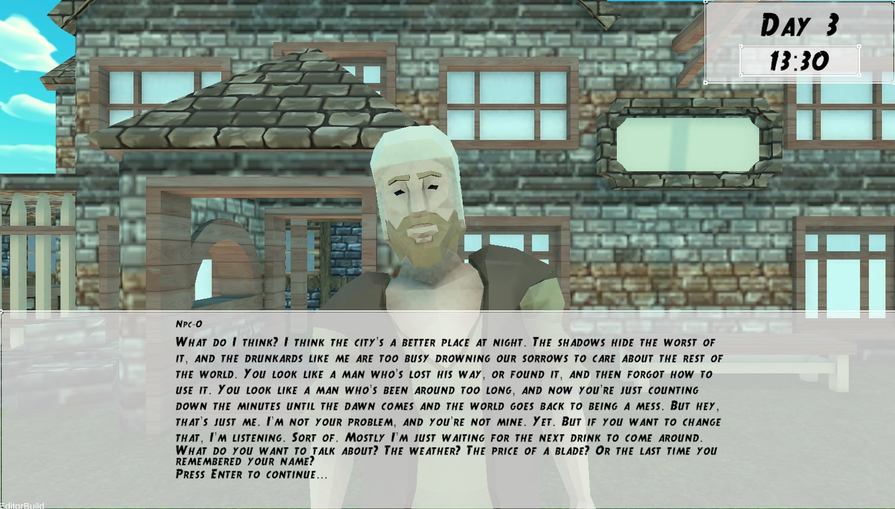
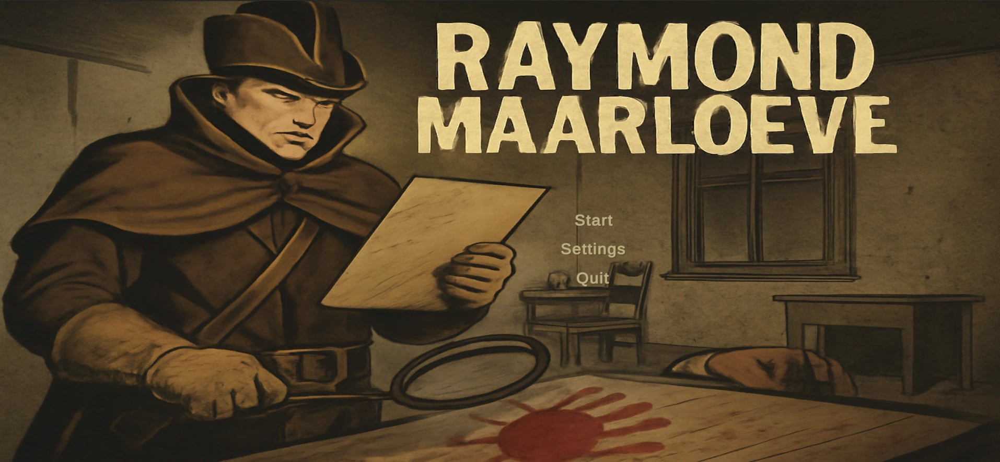

# Raymond Maarloeve sp. z o.o. 2nd term

<table>
<tr>
<td>

</td>
<td>

</td>
</tr>
</table>

---

## 📚 Documentation
Full project documentation is available at:  
🔗 **[https://raymondmaarloeve.github.io/RaymondMaarloeve/](https://raymondmaarloeve.github.io/RaymondMaarloeve/)**  

🔻 **We have added a launcher for the game, available at:**  
🔗 **[https://github.com/RaymondMaarloeve/RaymondMaarloeveLauncher](https://github.com/RaymondMaarloeve/RaymondMaarloeveLauncher)**  
All instructions related to the launcher can be found on that page.  

🧠 **We have also created a separate repository for the server responsible for handling our LLMs:**  
🔗 **[https://github.com/RaymondMaarloeve/LLMServer](https://github.com/RaymondMaarloeve/LLMServer)**

### 📄 Description
The project we are working on is a computer game in which artificial intelligence (AI) plays a key role. Its main feature is a dynamic world where non-player characters (NPCs) have their own personalities, daily schedules, and the ability to react to player actions. Thanks to AI, each gameplay session is unique, and NPC behavior influences both the storyline and the player's decisions.

What sets this game apart is the lack of traditional, rigid scripting for events. Instead, the game world develops organically, and interactions between NPCs and the player determine the course of the detective investigation, which is the central element of the gameplay. Procedurally generated environments and complex NPC decision-making systems make each game session a unique experience.

Whether you're on Windows or Linux, the game runs seamlessly, so you can enjoy the experience regardless of your operating system.

### ⚙️ Technology Stack
- **Game Engine:** Unity 6 (6000.0.38f1) + C#
- **Artificial Intelligence:**  
  - Large Language Model (LLM), pathfinding with NavMesh  
  - We use **Llama 3.2 3B Instruct** for all in-game LLM-driven behaviors, including NPC dialogue and decision-making.
- **Graphics:**  
  - [Kenney Fantasy UI](https://kenney.nl/assets/fantasy-ui-borders) 
  - [Free Medieval 3D People Low Poly Pack](https://free-game-assets.itch.io/free-medieval-3d-people-low-poly-pack) 
  - [CC0 Terrain Textures](https://opengameart.org/content/cc0-terrain-textures)  
  - Free assets ([Itch.io Free Assets](https://itch.io/game-assets/free/tag-isometric))  

- **Audio:**  
  - [Foot Steps](https://assetstore.unity.com/packages/audio/sound-fx/foley/footsteps-essentials-189879) 

- **CraftPix 3D Models:**  
  - [Free Medieval Props](https://craftpix.net/freebies/free-medieval-props-3d-low-poly-pack/) 
  - [Medieval Weapons Pack](https://craftpix.net/product/medieval-weapons-3d-low-poly-models/) 
  - [Free Bush Models](https://craftpix.net/freebies/free-bush-3d-low-poly-models/) 
  - [Medieval Buildings Pack](https://craftpix.net/product/medieval-building-3d-low-poly-models/) 
  - [Free Shrubs, Flowers & Mushrooms](https://craftpix.net/freebies/free-shrubs-flowers-and-mushrooms-3d-low-poly-models/) 
  - [Free Tree Pack](https://craftpix.net/freebies/free-tree-3d-low-poly-pack/)  
  - [Free Sword Models](https://craftpix.net/freebies/free-sword-3d-low-poly-models/) 
  - [Tree Pack )](https://craftpix.net/product/tree-3d-low-poly-models/) 
  - [Environment Props](https://craftpix.net/product/environment-props-3d-low-poly-pack/) 
  - [Free Environment Props](https://craftpix.net/freebies/free-environment-props-3d-low-poly-models/) 
  - [Medieval Fortress Pack](https://craftpix.net/product/medieval-fortress-pack-3d-low-poly-models/) 

---

## 🧑‍💻 Team

- **Leader:** Cyprian Zasada  
- **Deputy Leader:** Marek Nijakowski  
- **Team Members:**  
  - Paweł Reich  
  - Paweł Dolak  
  - Maciej Pitucha  
  - Maciej Włudarski  
  - Karol Rzepiński  
  - Kamil Włodarczyk  
  - Łukasz Jastrzębski  
  - Michał Eisler  
  - Łukasz Czarzasty  

---

## Introduction to development plan

The main goal of the project’s development is to improve the LLM system through collaboration with the PG server.  
Additionally, some minor gameplay improvements and fixes are planned.  
The server will primarily be used to train the model, but it will also serve as a platform for running more powerful models during testing.

---

## Assumptions

### 1. PG Server

1. Connect to the PG server.  
2. Select the best model, taking into account the server’s capabilities and the average user’s hardware.  
3. Create a new LLM manager that allows multiple models to operate in parallel.  
4. Distill a large LLM into smaller, specialized versions.

---

### 2. Narrator

A more advanced model will be chosen for the narrator to reduce story generation errors.  
A new mechanism for generating a chronological timeline of events on the day of the crime will be added.  
This will make the investigation and fact-connecting process more engaging for the player.  
Furthermore, the murderer will be forced to lie, introducing the need for comparing facts and testimonies.

---

### 3. Game

#### 3.1 Final Minigame

The final minigame system will be redesigned.  
Currently, solving the case involves selecting correct facts and identifying the killer.  
In this new version, the player will have to **verbally describe the sequence of events** and **convince the LLM** who the murderer is during a dialogue.

#### 3.2 Launcher

The launcher’s functionality will be moved into the in-game menu.  
From the menu, players will be able to **download models** and **define NPC personalities**.

#### 3.3 Gameplay

1. Implement a better camera system to enhance immersion and fix NPC visibility issues.  
2. Add new character models and associated actions.  
3. Display a small speech bubble above each NPC showing their current activity.  
4. Allow NPCs to engage in conversations with each other.  
5. Introduce a detective notebook system for recording notes about each NPC.  
6. Improve the minimap to better indicate NPC positions.

---

### 4. Publication

The game will be published on a selected gaming platform.

---

## 5. Deliverables

### First Milestone

1. Working infrastructure for model communication with the PG server.  
2. Distilled NPC model.  
3. Improved narrator model.  
4. NPCs capable of conversing with one another.  
5. Some new character models and actions.  
6. Detective notebook system for NPC tracking.  
7. Improved minimap and NPC indicators.

### Second Milestone / Final Submission

1. Launcher functionality moved into the main menu.  
2. Additional character models and actions.  
3. NPC action indicator (speech bubble).  
4. Fixed and improved camera system.  
5. NPC personality descriptions transmitted to the model via embeddings.  
6. New final minigame system.  
7. Public release of the game.

